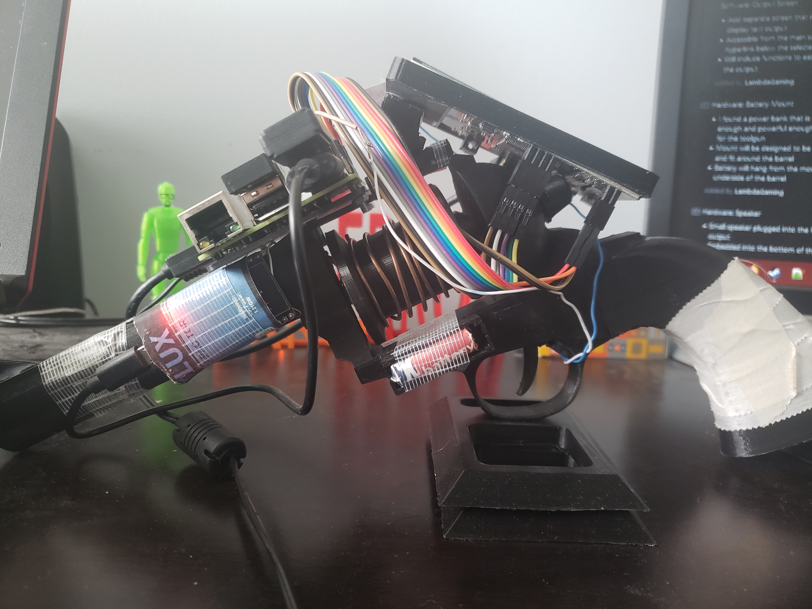
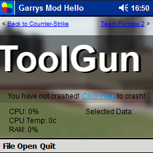

# Tool Gun
Fully working and customizable Garry's Mod tool gun using a Raspberry Pi (and many other components).

# Features
## UI
 The UI is nearly identical to the one seen in-game. The biggest differences are that this one is actually interactive and includes more than one menu. Below is a complete list of UI features.
- 24-hour clock
- Audio mute status
- Scrolling text that displays the title of currently selected tool
- CPU and RAM usage stat
- CPU temperature stat
- Currently selected tool data
- File menu - Displays system and tool-specific data options
- Open menu - Displays list of tools
- Quit button

## Tools
Unfortunately, this tool gun is incapable of defying the laws of physics, but you can still do some fun things with it. The main functionality of the tool gun comes from separate Python programs called tools, which are found in the Open menu. Every tool is designed to perform a single function, but the data that gets input into the function can be changed via the File menu. For example, the Samsung TV Remote tool can only transmit IR codes with the Samsung protocol and nothing else, but the specific code that gets sent can be configured. Much like the game, activating the tool with the selected data is done by pulling the trigger, which in this case is a simple GPIO button. By default, the tool gun only comes with a few tools, but you can easily create your own using the [base provided](tool_base.py).

### Current List of Tools
- Samsung TV Remote
  - Has presets for standard Samsung TV remotes. Uses the IR transmitter.
- BrizLabs Fairy String Remote
  - Has presets for the [BrizLabs Fairy String Lights.](https://www.brizlabs.com/brizlabs-66ft-200-led-rgb-fairy-lights-remote-control) Uses the IR transmitter.
- LED Web Server Remote
  - Has preset colors for [my LED Web Server.](https://github.com/LambdaGaming/LEDWebServer) The server is an ESP32 hooked up to the data wire of a BrizLabs fairy light string. It allows individual LEDs to be set to any color via an HTTP POST request.

# Building Your Own
If you want to make a tool gun yourself, everything you need is listed [here.](REQUIREMENTS.md) Once you have the required items, you can follow the setup instructions [here.](SETUP.md).  
If you have little to no experience with Linux, the Raspberry Pi, Arduinos, and/or electronic circuits, I HIGHLY recommend you learn the basics of each before attempting to make this, as the guides assume you're already familiar with these things. I will not provide support for issues you may encounter that aren't directly related to this project.
